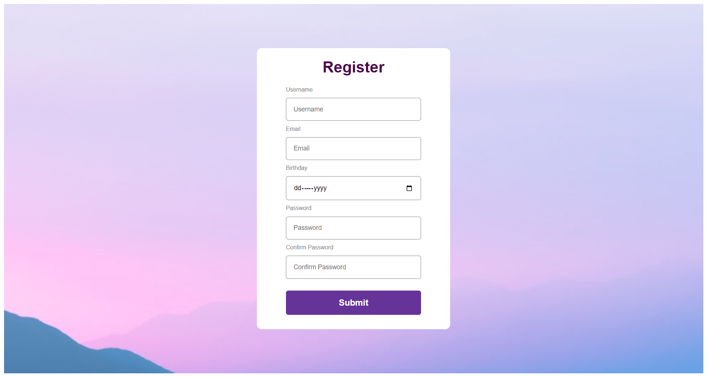

<div align="center">
    <a href="https://form-nolibrary-react.netlify.app" target="_blank">
      
    </a>
  <h3 align="center">Form from Scratch - React</h3>
</div>

##  <br /> 📋 <a name="table">Table of Contents</a>

- ✨ [Introduction](#introduction)
- ⚙️ [Tech Stack](#tech-stack)
- 📝 [Features](#features)
- 🚀 [Quick Start](#quick-start)

##  <br /> <a name="introduction">✨ Introduction</a>

**[EN]** A form built from scratch using React, showcasing different methods for handling and validating form inputs. This project demonstrates form management with useState, useRef, and FormData, without relying on additional libraries. It explores various approaches to validate and handle user input effectively.

**[FR]** Un formulaire construit de zéro avec React, illustrant différentes méthodes pour gérer et valider les entrées de formulaire. Ce projet démontre la gestion des formulaires avec useState, useRef et FormData, sans recourir à des bibliothèques supplémentaires. Il explore diverses approches pour valider et gérer efficacement les données utilisateur.

##  <br /> <a name="tech-stack">⚙️ Tech Stack</a>

- [**React**](https://react.dev/reference/react) is a popular JavaScript library for building user interfaces, particularly single-page applications where data changes over time. React's component-based architecture allows developers to create reusable UI components, making development more efficient and the codebase easier to maintain. 

- [**Vite**](https://vitejs.dev/guide/) is a modern front-end build tool that offers a fast and efficient development environment. It leverages ES modules for quick build times and features hot module replacement (HMR) for instant updates, making it ideal for frameworks like React, Vue, and Svelte. Vite's minimal configuration helps streamline development workflows.


## <br /> <a name="quick-start">🚀 Quick Start</a>

Follow these steps to set up the project locally on your machine.

<br/>**Prerequisites**

Make sure you have the following installed on your machine:

- [Git](https://git-scm.com/)
- [Node.js](https://nodejs.org/en)
- [npm](https://www.npmjs.com/) (Node Package Manager)

<br/>**Cloning the Repository**

```bash
git clone {git remote URL}
```

<br/>**Installation**

Let's install the project dependencies, from your terminal, run:

```bash
npm install
# or
yarn install
```

<br/>**Running the Project**

Installation will take a minute or two, but once that's done, you should be able to run the following command:

```bash
npm run dev
# or
yarn dev
```

Open [`http://localhost:5173`](http://localhost:5173) in your browser to view the project.